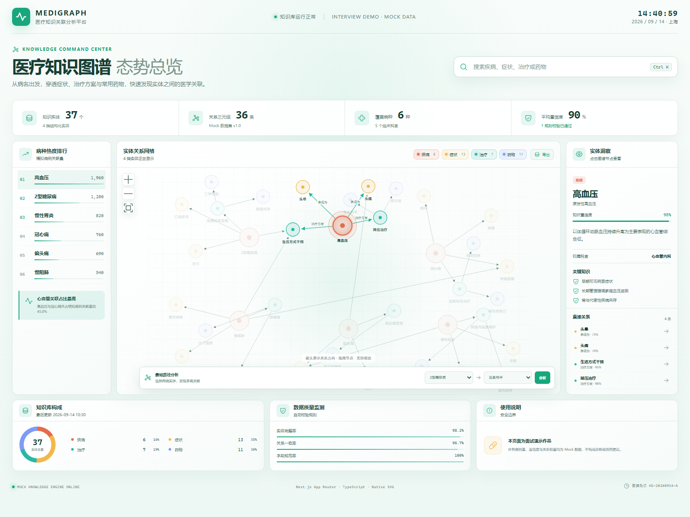
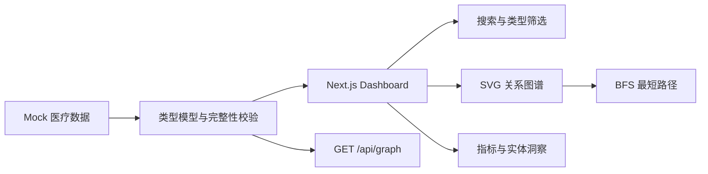

# MEDIGRAPH 医疗知识图谱大屏

基于 Next.js 构建的交互式医疗知识图谱 Demo。项目使用自建 Mock 数据，将疾病、症状、治疗方案和常用药物组织为可搜索、可筛选、可追踪路径的关系网络。

> 本项目用于前端技术测试。所有病例量、置信度和医学关系均为演示数据，不构成诊断或用药建议。



## 需求完成情况

| 题目要求 | 实现方式 | 状态 |
| --- | --- | --- |
| 自建数据集 | 37 个医疗实体、36 条带类型和置信度的关系 | 已完成 |
| 病名、症状、治疗、用药 | 使用四类异构节点和有向关系建模 | 已完成 |
| 可展示的数据大屏 | 指标总览、关系网络、病种排行、实体洞察、数据质量面板 | 已完成 |
| 使用 Next.js | Next.js App Router + React + TypeScript | 已完成 |

## 核心能力

- 全局搜索：支持按名称、别名和科室检索，`Ctrl/Cmd + K` 快速聚焦。
- 图谱探索：点击节点查看实体详情，使用一跳 / 二跳邻域聚焦快速生成局部子图。
- 关系证据：点击关系线查看语义三元组、置信度、Mock 数据来源和更新时间。
- 多维筛选：支持实体类型与关系类型组合筛选，并实时显示当前子图规模。
- 图谱交互：画布平移、节点拖拽、视图缩放、关系方向箭头与键盘访问。
- 路径分析：使用 BFS 查找任意两个实体之间的最短关系路径。
- 数据导出：将当前类型、关系和邻域筛选后的子图导出为 JSON。
- 数据大屏：展示实体数、关系数、疾病覆盖、平均置信度和模拟病例排行。
- 数据校验：启动和构建时检查重复节点、断链、自连接和置信度范围。
- 响应式与无障碍：支持桌面、平板和移动端布局，提供键盘操作与减少动态效果适配。

## 技术栈

| 技术 | 用途 |
| --- | --- |
| Next.js 16 App Router | 页面、静态预渲染和 Mock API |
| React 19 | 交互状态和组件组织 |
| TypeScript 5 | 节点、关系和组件契约 |
| Native SVG | 图谱渲染、方向箭头和节点交互 |
| Native CSS | 大屏布局、响应式设计和视觉系统 |
| Phosphor Icons | 一致的界面图标 |

项目没有引入图形库或全局状态库。当前只有 37 个节点，原生 SVG 和 React 局部状态已经足够，也让核心交互逻辑更容易审阅和讲解。

## 系统架构



当前页面直接使用同一份类型化数据，`/api/graph` 对外提供一致的数据契约。生产环境可将数据层替换为 Neo4j、FastAPI 或业务接口，展示组件不需要改变核心模型。

## 知识模型

核心数据位于 `data/medical-data.ts`。

```ts
type EntityType = "disease" | "symptom" | "treatment" | "drug";

type MedicalNode = {
  id: string;
  name: string;
  type: EntityType;
  description: string;
  department: string;
  confidence: number;
  facts: string[];
};

type MedicalLink = {
  source: string;
  target: string;
  relation: "表现为" | "治疗方案" | "常用药" | "联合用药";
  confidence: number;
};
```

关系使用“主语—谓语—宾语”表达：

```text
高血压 --表现为--> 头晕
高血压 --治疗方案--> 降压治疗
降压治疗 --常用药--> 氨氯地平
```

图谱渲染保留关系方向；最短路径用于探索关联，因此遍历时允许沿关系双向搜索。BFS 的时间复杂度为 `O(V + E)`，适合当前无权图数据。

## 项目结构

```text
MEDIGRAPH/
├─ app/
│  ├─ api/graph/route.ts       # Mock 图谱接口
│  ├─ globals.css              # 大屏视觉与响应式样式
│  ├─ layout.tsx               # 页面元数据和根布局
│  └─ page.tsx                 # 首页入口
├─ components/
│  ├─ knowledge-graph.tsx      # SVG 图谱与节点交互
│  └─ medical-dashboard.tsx    # 搜索、指标、路径分析和详情
├─ data/
│  └─ medical-data.ts          # Mock 数据、BFS 与数据校验
├─ scripts/
│  └─ check-data.mjs           # 可独立运行的数据检查
└─ outputs/
   └─ medigraph-light.png      # 项目效果图
```

## 本地运行

环境要求：Node.js 20.9 或更高版本，推荐 Node.js 22。

```bash
npm install
npm run dev
```

访问：

- 数据大屏：<http://localhost:3000>
- Mock API：<http://localhost:3000/api/graph>

## 提交前检查

```bash
npm run check
```

该命令依次执行：

1. `npm run typecheck`：TypeScript 类型检查。
2. `npm run check:data`：图谱数据与示例路径检查。
3. `npm run build`：Next.js 生产构建。

当前验证结果：

```text
Graph check passed: 37 nodes, 36 links, sample path 4 hops.
Next.js production build passed.
```

## API 数据契约

`GET /api/graph` 返回：

```json
{
  "meta": {
    "source": "interview-mock",
    "updatedAt": "2026-09-14 10:30",
    "version": "1.0.0"
  },
  "nodes": [],
  "links": []
}
```

## 3 分钟演示脚本

1. **说明需求**：这是一个由疾病、症状、治疗和药物构成的异构医疗知识图谱。
2. **搜索实体**：按 `Ctrl + K`，搜索“高血压”，点击结果定位节点。
3. **邻域聚焦**：选择“一跳”，只保留高血压及直接相关的症状和治疗，再切换“二跳”展开相关药物。
4. **关系证据**：点击“高血压 → 降压治疗”关系线，展示三元组、置信度、来源和更新时间。
5. **语义筛选**：只保留“常用药”，说明实体筛选与关系筛选可以组合生成目标子图。
6. **路径分析**：恢复全图，选择“2型糖尿病”和“氨氯地平”，展示 BFS 找到的 4 跳路径。
7. **图谱操作**：拖拽空白区域平移画布，再拖动单个节点，说明两类手势互不冲突。
8. **数据闭环**：导出当前子图 JSON，再打开 `/api/graph` 说明前后端数据契约。
9. **技术取舍**：当前规模使用原生 SVG；达到数千节点后改为服务端子图查询和 WebGL 渲染。

